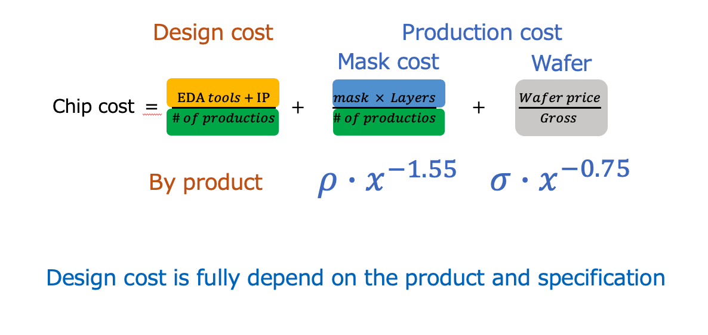
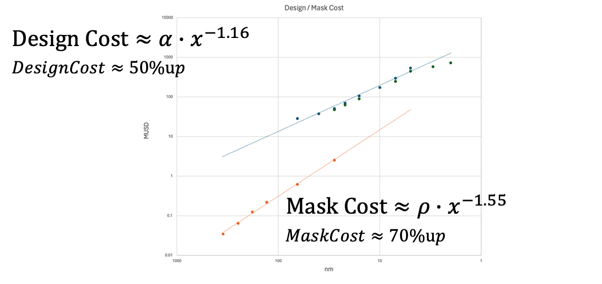
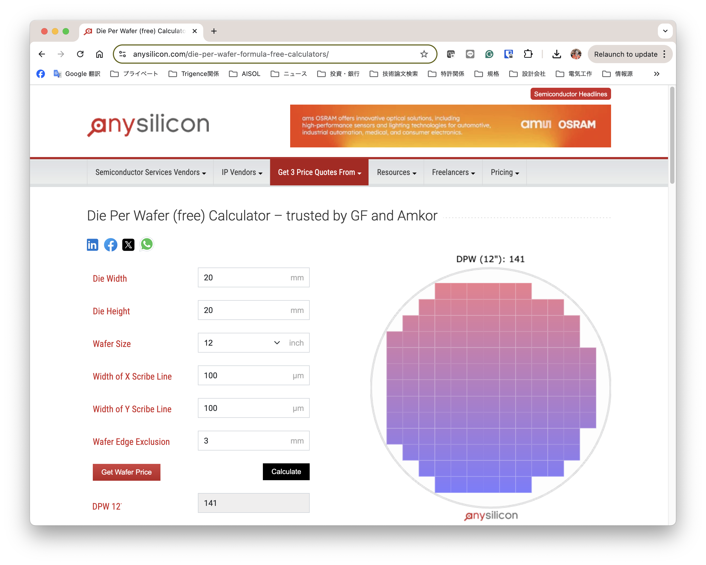

# A Qualitative Overview of Semiconductor Costs

> [!NOTE]
> This article was translated by ChatGPT4 from the original [Japanese version](https://qiita.com/jun1okamura/items/46baa5a35066f18a0801), which had over 36,000 views since 2024/Aug/1st.

## Preface 
In 1990, NHK highlighted Japan as an "Electronic Nation," bringing the semiconductor industry into the spotlight. Thirty years later, that focus has returned. While cutting-edge manufacturing technology is at the forefront, this article chooses to step back from technical discussions to qualitatively analyze the semiconductor business by exploring the costs incurred over the past 30 years from a broader perspective.
While much attention is being given to the advancements in semiconductor scaling driven by Generative AI and substantial development investments, this article offers a measured analysis of the costs associated with such scaling. The aim is to make the semiconductor business more comprehensible, even for those outside the industry. Your feedback and critique would be greatly appreciated.

>[!WARNING]
> Please be aware that this content is based on my past work experience and expresses my personal opinions and viewpoints. It does not represent the official stance of any organization.

## What is Scaling?
Why do we scale semiconductors? Essentially, scaling refers to the technology used to make components smaller. This enables more functions to be packed into the same physical space. The semiconductor business is sometimes likened to real estate, where building a two-story house on the same plot instead of a single-story one would double the rental income. In this sense, scaling technology can be seen as the architectural technology that allows for the construction of taller buildings.

## Understanding Moore's Law
>[!TIP]
>Moore's Law is a concept introduced by Gordon Moore in 1965, who later co-founded Intel. He predicted that the number of components on an integrated circuit would double every year, with this trend expected to continue for at least another 10 years. In 1975, he adjusted this prediction, forecasting that the doubling would occur every two years over the next decade. This two-year doubling prediction has held steady since 1975, becoming widely known as ["Moore's Law."](https://ja.wikipedia.org/wiki/%E3%83%A0%E3%83%BC%E3%82%A2%E3%81%AE%E6%B3%95%E5%89%87)

What distinguishes semiconductor scaling from architectural advancements is the rapid development pace and the continual push of technological boundaries, all in line with Moore's Law. To put it in perspective, it’s like if the number of floors in a building doubled every two years for the past 65 years.

As a result, starting from the commercialization of a device in 1959 that integrated just two transistors on a single silicon chip, the industry has achieved a doubling of transistors every two years. By 2024, this has culminated in the ability to place 80 billion transistors on a single silicon chip.

### Why Focus on scaling?
The semiconductor business is sometimes compared to the printing industry because the value brought by scaling is somewhat similar. Essentially, scaling enables the doubling of the amount of text that can be printed on a single page, allowing twice the information to be packed onto one page at almost the same cost. Although the human eye cannot read such scaled text, semiconductors read and write using electricity, making it possible to handle even electron-sized scaling. In fact, cutting-edge memory devices already store information in clusters of just a few electrons.

### Scaling and 3D Technology
Semiconductor scaling has progressed through the refinement of photomask technology, analogous to the master plates in the printing industry, and through the process of exposing and developing these masks onto silicon resist. However, as scaling advances, it becomes necessary to reduce the wavelength of the light used for exposure. Currently, Extreme Ultraviolet (EUV) light with a wavelength of 13.5nm is utilized in the most advanced technologies.

Interestingly, Japanese equipment manufacturers, who once led the world with exposure machines using laser light sources such as KrF (248nm) and ArF (193nm), have fallen behind due to their inability to mass-produce machines utilizing EUV light sources. This has allowed the Dutch company ASML to dominate the market. However, as no light source with a wavelength shorter than 13.5nm has been developed yet, discussions are now focusing on increasing the number of transistors per unit area using 3D technology, similar to architectural techniques. [IMEC roadmap](https://www.imec-int.com/en/articles/20-year-roadmap-tearing-down-walls)

Traditionally, semiconductor scaling has been defined by the minimum feature size, $`(\times 1/\sqrt{2.0})`$, representing each generation. Each generation was characterized by a reduction in feature size that allowed for doubling the number of transistors. However, with recent advanced semiconductor technologies, generations are no longer defined by feature size alone but by the introduction of new technologies that enable the integration of twice as many transistors. Instead of terms like XXnm, we now see terms such as A10 or A7 (where A stands for Angstrom). Similar to the difference between iPhone 14 and iPhone 15, these numbers have lost much of their inherent meaning.

## The Cost of Scaling
We have briefly discussed semiconductor scaling and its associated value. Now, let's examine the costs involved. While scaling does create double the value, if the cost to achieve it also doubles, there is no business advantage. Therefore, the cost of scaling must be less than double. To understand this, we will first break down the cost structure of the semiconductor industry.

The cost of semiconductor devices can be broadly categorized into three main areas: 1) design and development, 2) mask costs, and 3) manufacturing costs. Of these, the first two can be amortized over the production life cycle, making manufacturing the primary cost driver.

In the sections that follow, we will qualitatively analyze the trends in each of these cost components.

### Wafer Prices
The following graph illustrates the trend in TSMC’s wafer prices, based on publicly available information and insights gathered from discussions. The horizontal axis ranges from 0.35um to 28nm, while the vertical axis represents the price per wafer in USD.

Although the graph may not be perfectly accurate, it offers a good overview of the wafer price trends (which roughly equate to manufacturing costs). Some estimates, $`W_{price} = \sigma・x^{-0.75}`$, can be made from the slope of the graph (with thanks to Mr. Shoichi Kakami from [Unisantis](https://unisantis.com/) for the information).

In essence, if you’re producing a large enough volume of wafers that design, development, and mask costs become negligible, you can achieve the benefits of scaling (doubling the value) with only a modest increase in cost (1.3 times).

$$(1/\sqrt{2.0})^{-0.75} = 1.3$$

This suggests that the semiconductor industry has developed scaling technologies with mass production in mind. However, it’s also important to recognize that manufacturing costs increase exponentially as scaling continues.

>[!TIP]
>Moreover, if the current price trend persists, the wafer price for the 2nm generation is expected to exceed $20,000 (with some [reports](https://news.mynavi.jp/techplus/article/20230629-2715416/) suggesting it could reach $25,000). Given a typical chip size of 10x10mm and a yield of about 500 dies per 300mm wafer, the cost per chip would be approximately $50.

### Mask Costs
Let’s now discuss the costs associated with masks. In general, as semiconductor scaling progresses, the precision required for mask fabrication increases, which in turn drives up the unit cost. Additionally, as scaling advances, there’s an increase in the variety of transistors and the number of wiring layers. Moreover, in state-of-the-art semiconductor manufacturing, double patterning (a double exposure technique) is often required, leading to a continuous rise in the full mask costs necessary for creating integrated circuits.

The following graph illustrates TSMC’s full mask prices for various generations of scaling, based on gathered information and publicly available data.

While the graph may not be perfectly accurate, it offers a general view of the trend in mask prices (which roughly correspond to the manufacturing NRE costs). Some estimates, $`MaskCost = \rho・x^{-1.55}`$, can be drawn from the slope of the graph.

In summary, mask costs tend to increase at a higher rate than wafer prices as scaling progresses.

$$(1/\sqrt{2.0})^{-1.55} = 1.7$$

While wafer costs rise by 30% with each step in scaling, mask costs increase by 70%. However, as previously mentioned, if mass production is assumed, the mask costs can be amortized over the entire production volume, making them less significant. It’s important to recognize that the rise in mask costs outpaces that of wafer costs, meaning the number of wafers required to amortize these costs tends to grow as scaling advances.

### Design and Development Costs
Design and development costs are incurred for each project, and similar to mask costs, they can be amortized over the total production volume.

Are design and development costs increasing with scaling, just like mask and wafer costs? According to studies by IBIS in 2018 and 2023, which examined the design costs for startups creating a chip from scratch, design costs have been shown to increase exponentially with scaling.

Let’s plot these design costs on the same graph as the mask costs.

Naturally, design costs vary significantly from project to project, but the graph shows that design costs increase by 50% as scaling progresses. It also indicates that design costs are generally more than 10 times higher than mask costs.

$$(1/\sqrt{2.0})^{-1.16} = 1.5$$

It’s important to note that as scaling advances, mask costs are rapidly catching up to design costs. If this trend continues, mask costs may surpass design costs.

>[!TIP]
>In the generation of advanced semiconductors (<2nm), design costs have ballooned to exceed 1 billion USD (150 billion yen), far beyond the development investment capital available to most startups. It’s becoming apparent that only cash-rich, top-tier companies can feasibly pursue device development using advanced semiconductor technology.

### Semiconductor Cost Analysis
Let’s revisit the semiconductor cost equation.

To gain a better understanding, let’s plot the wafer costs for various scaling generations, using the horizontal axis for the total lifetime production of wafers and the vertical axis for the cost.

The graph illustrates that around 100,000 to 1 million wafers need to be produced to amortize the initial costs (design costs + mask costs). Therefore, when production volumes are limited by these initial costs, it’s necessary to price the product in a way that includes both the optimal production costs and the initial costs to ensure profitability. This implies that semiconductors with smaller lifetime production volumes will inevitably have higher prices compared to those with larger production volumes, assuming they offer similar functionality. Essentially, only products that can sell at these higher prices will be viable from a business standpoint.

This graph underscores the fact that the semiconductor industry fundamentally benefits from economies of scale through mass production.

### Wafer Gross
Semiconductor chips are ultimately cut from a circular wafer, but because the chips are square, the larger the chip size, the more unusable area there is around the wafer's edges. The number of chips that can be cut from a single wafer is referred to as the "gross," and there are online tools available to calculate this. [Gross caliculator](https://anysilicon.com/die-per-wafer-formula-free-calculators/)

The smaller the chip size, the less unusable area there is around the wafer’s edges, so the gross number of chips gets closer to the wafer area divided by the chip area. Conversely, the larger the chip size, the more unusable area there is around the wafer, and the gross number becomes less than the wafer area divided by the chip area. Additionally, the maximum chip size is limited by the specifications of the exposure machine and the mask size (200x200mm), with the usual maximum chip size being 26x33mm, also known as the "reticle limit."

Below are the gross calculation results for a 300mm wafer with typical chip sizes.

In the previous section, we discussed how the semiconductor business becomes profitable when the lifetime production of wafers is between 100,000 and 1 million. Assuming a chip size of 7x7mm, the gross number would exceed 1,000, meaning that the lifetime production of chips that become profitable would range from 1 to 10 billion chips.

### Yield
Another critical factor to consider in the semiconductor business is yield. Defective chips result from defects (such as foreign particles or scratches) on the finely processed wafer. Therefore, reducing the "contamination" that causes defects during the manufacturing process is crucial for quality control, necessitating the use of cleanrooms, high-purity gases, water, and specialized chemicals. Even with these measures, it is impossible to completely eliminate defects. The aim is to keep the defect density (number of defects per unit area) below a target level, which serves as a key indicator for managing the manufacturing line.

When the defect density is D and the chip area is A, the yield follows the Poisson distribution function below.

Let’s examine the relationship between chip size and yield.

As the chip size increases, the yield drops significantly.

Assuming a wafer price of USD 3,400 and a defect density of D, the yield, number of good chips, and chip price for representative chip sizes are calculated as shown below.

The fact that semiconductor chips used in most PCs and mobile phones are generally no larger than 10x10mm suggests that controlling defect density within an economically reasonable range and keeping the chip size within a range that ensures an appropriate yield is crucial for maintaining stable production costs.

Let’s plot the relationship between net gross (considering yield) and chip size.

This graph illustrates that when the chip size is sufficiently small, the net gross is inversely proportional to the chip size. However, as the chip size increases, the net gross gradually decreases due to the impact of yield. Therefore, if the goal is to enhance chip functionality by increasing its size, it may be more advantageous to reduce the chip size by advancing to the next generation of scaling.

### Intel's Tick-Tock Strategy
This trend can be observed in [Intel's chip size data.](https://pc.watch.impress.co.jp/docs/2007/1005/kaigai03.pdf
)

At that time, Intel followed a strategy known as "Tick-Tock," in which they alternated between architectural changes and process node advancements. The strategy involved updating the architecture using an older process node, and then moving to a smaller process while maintaining the same architecture. This approach meant that while adding new features on an older process node increased chip size and cost, it minimized yield risks when introducing a new architecture. Once the newer process stabilized, Intel would reduce the chip size of the new architecture, thereby lowering costs and maximizing profits. (This strategy has since been revised.)

### Nvidia's Strategy
Nvidia, in contrast, has employed a different approach to maintain its dominance in the AI-driven GPU market.

As the trend clearly indicates, Nvidia consistently pushes chip sizes to the reticle limit, aiming to integrate the maximum number of transistors possible with each generation. Naturally, this leads to lower yields and higher chip costs. However, since they hold a dominant market position, they can command high prices and continue to drive performance forward. For example, the H100 is reportedly priced at around USD 40K, which is significantly higher than the estimated wafer cost of USD 12K for 5nm technology. This means that even with only one viable chip per wafer, the business remains profitable.

>[!TIP]
>GPUs generally feature a highly parallel circuit design, allowing for the inclusion of redundant circuits that can be switched in to tolerate some level of defects. With careful design of these redundant circuits, yield can be further improved.

## Understanding the Semiconductor Business
In this discussion, we’ve explored the cost trends associated with semiconductor scaling. Despite 65 years of Moore’s Law holding true, and the continuous advancement of scaling technology, the associated costs are also on the rise. **For a semiconductor business utilizing advanced manufacturing technology to be sustainable, it’s vital to develop markets that require high-volume production and can accommodate chips that withstand pricing pressures.**

Conversely, in the long-tail semiconductor business, which involves low-volume production for products with extended manufacturing lives—such as automotive, industrial equipment, manufacturing equipment, and defense-related products—chip prices are predominantly influenced by design and mask costs. Since these costs increase more significantly with scaling than manufacturing costs, it’s often more advantageous from a business perspective to opt for legacy processes rather than pursuing further scaling.

In the long-tail semiconductor business, where production volumes are lower, the key challenge is identifying “what can be implemented and achieved with a limited number of transistors.” I believe that the ability to solve this challenge and leverage it into a business opportunity is exactly what Japan’s industry should focus on.

## What's Next
I am considering covering topics that offer a comprehensive view of the future semiconductor business, such as reducing initial costs in long-tail semiconductor development through the use of open-source EDA tools and IP, prototyping via mask sharing (MPW, MLM, etc.), new patterning technologies like digital exposure systems and NIL, and chiplet technology for assembling large chips beyond the reticle limit by integrating multiple chips into a single package, along with the associated technical challenges.
